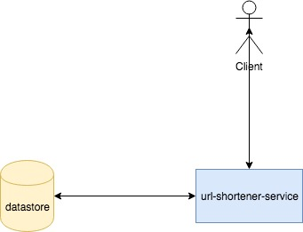

# High level design (how system does what it is suppose to do and how all components fit togther)

---

### Introduction

### Estimates
* no of users : 100
* no of get queries(given shorten url redirect to original url) : 10 / sec
* no of put queries(create a shorten url for a long url) : 2 / sec
* TPS : 100 * (10 + 2) = 1200
* response time : ?

### Approach
* we should be able to generate a shorten url.
    * we can generate url that wasn't generated before.
        * The problem with this is if node goes down then we need to query to check the perviously generated url.
        * ensuring other node does not generate same shorten url.
    * we can generate a url and try persisting in store, if its already there regenrate.
* we should store the original url in some persistent store so that it can be queried latter.
    * what should we store?
    * we can store the shortened url as key and original url as value.
    * we can use local file-system to store the key value.
        *  problem with this would be the node won't be to determine what's in other node.
        *  we can have load balncer keeping index of shortened url and route accordingly.
        *  if node goes down the persisted stored in that node also goes away.
    * we can use a datastore to persist the key value.

### characterstics of datastore (don't try to choose any X datastore instead characterize it)
* key value store
* highly available
* should maintain multiple replica
* should be extensible, to store analytical data latter
* [optional] should prevent duplicate key insertion

### High level API's
* get(short-url): returns the actual original url if present otherwise error.
* post(original-url): returns a shorten version of original url.

### Solution
* 

### challenges
* how do we ensure that multiple nodes generate a single unique global shorten url.

---

